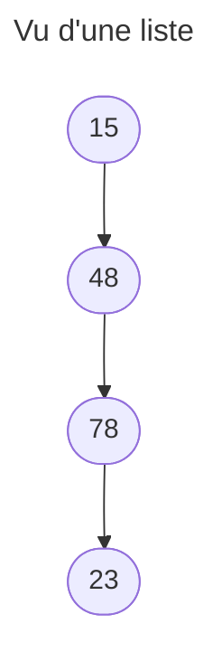

Par Thomas SAZERAT
# Définition
Les listes, ou chainages, c'est une famille de structure de données qui permet de représenter une suite d'éléments.
Vous connaissez peu être les List, Map, Tuple qui sont présent dans de nombreux langages, tel que Java.

Voici une représentation d'une liste qui contient des nombreux :

Le terme "chainage" via du faite que les flèches et les éléments de la liste ressemble au maillon d'une chaine.
# Pile (Stack)
## Définition
La structure de données "Pile" correspond exactement à la définition qu'on s'en fait en français. Pour la visualiser, **penser à une pile d'assiettes au bord d'un évier**.
Lorsque vous **empilez**, c'est à dire que vous **ajouter une assiette**, vous le faite toujours **en haut de la pile d'assiettes**. A l'inverse, quand vous **dépilez**, vous **retirez** la **dernière assiette  ajouté, celle qui se trouve en haut de la pile**. Ici c'est exactement ça.

Le comportement de la pile est **exactement le même en C**, avec une logique **First In Last Out (FILO)**.
## Exercice
Vous faites un programme qui permet de gérer des tâches dans un logiciel. Ces tâches doivent être gérer via une pile. Une tâche à un **nom** et **une durée en seconde**.

Créez la structure tâche et implémentez une pile avec 3 fonctions :
- Empiler (void push(Stack* stack, Task *task))
- Dépiller (Task* pop(Stack* stack))
- Libérer (freeStack(Stack* stack))

# File (Queue)
## Définition
Comme la pile, la file est exactement ce que vous pensez : c'est une file d'attente ! On est sur une logique **First In First Out (FIFO)**.

Imaginez un bureau de poste ou plusieurs personnes attende pour aller au guichet. Le premier arrivé n'a pas eu à attendre, tandis que le deuxième à du attendre le premier, etc.

## Exercice
Le BDE à encore besoin de vous ! La vente de sandwich marche très bien, mais c'est compliquer de gérer la queue des étudiants qui attente leur repas. Votre missions, fait une liste d'étudiant (nom+prénom+promotion).

On veut pouvoir ajouter et supprimer un étudiant. L'affichage se fera directement via la fonction de suppression qui retournera l'étudiant qu'elle supprime.
